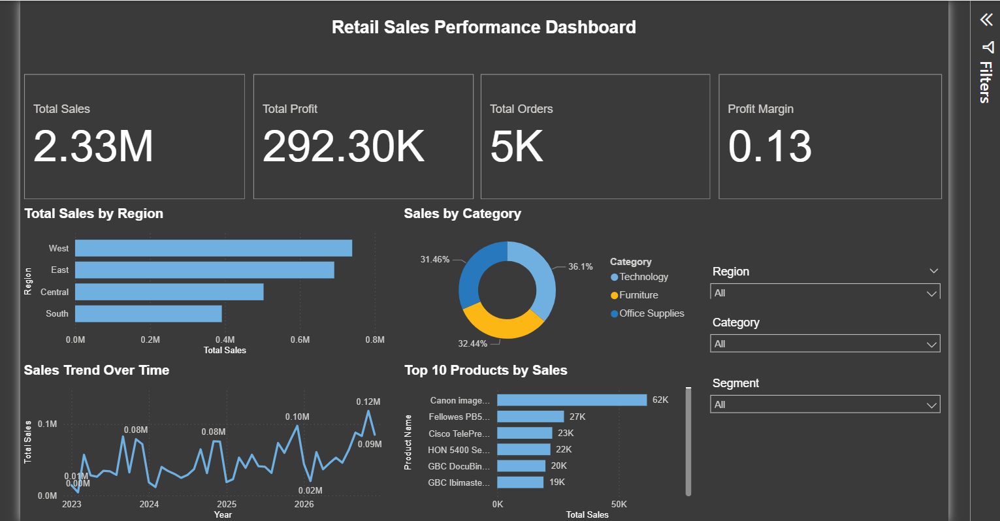

# Power BI Sales Performance Dashboard

## Overview
This project presents an interactive **Sales Performance Dashboard** built using Microsoft Power BI. The dashboard analyzes retail sales data to provide insights into revenue trends, regional performance, product category contribution, and top-selling products.

The goal of this project is to demonstrate **data visualization, business analysis, and dashboard design skills** using Power BI.

## Dataset
The dataset used is the **Sample Superstore Sales dataset**, which contains transactional retail data including:

- Order Date
- Region
- Segment
- Category
- Product Name
- Sales
- Profit
- Quantity
- Discount

## Tools Used
- Microsoft Power BI
- DAX (Data Analysis Expressions)
- Data Visualization
- Business Analytics

## Key Metrics
The dashboard highlights important business KPIs:

- **Total Sales**
- **Total Profit**
- **Total Orders**
- **Profit Margin**

These metrics provide a quick overview of overall business performance.

## Dashboard Features
The dashboard includes several visualizations to provide insights:

- **Sales Trend Over Time** – Shows how sales change across months.
- **Sales by Region** – Identifies which geographic regions generate the most revenue.
- **Sales by Category** – Displays the contribution of different product categories.
- **Top 10 Products by Sales** – Highlights the best-performing products.
- **Interactive Filters (Slicers)** – Users can filter results by Region, Segment, and Category.

These interactive features allow users to explore the data dynamically.

## Key Insights
Some insights that can be derived from the dashboard include:

- Identification of the **highest-revenue regions**
- Understanding which **product categories contribute the most to sales**
- Recognizing **top-performing products**
- Observing **sales trends over time**

## Dashboard Preview

## Project Files
The repository contains:

- `sales-performance-dashboard.pbix` – Power BI dashboard file
- `dashboard_preview.png` – Screenshot of the dashboard
- `Sample_Superstore_Dataset.xlsx` – Dataset used in the project

## Author

**Aarthi Rebecca**  
Master of Management – Business Data Analytics
University of Windsor
